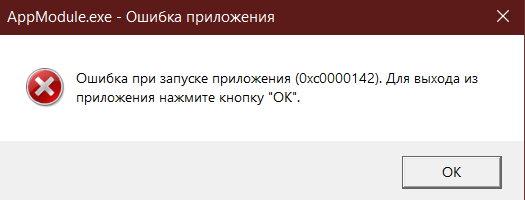

# Ошибка при запуске приложения (0xc0000142). Для выхода из приложения нажмите кнопку "ОК".

Эта ошибка означает, что в пути к игре присутствуют специальные символы или кириллица. Вам нужно [переместить папку с игрой в корень диска](root-drive.md).

После этого запустите игру снова от имени администратора.