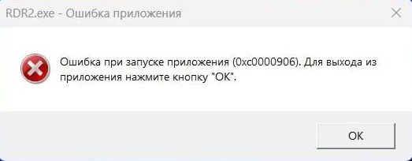

# Ошибка при запуске приложения (Охс0000906). Для выхода из приложения нажмите кнопку "ОК".

Эта ошибка означает, что один из файлов **кряка** игры был помещён в карантин. Вам нужно [восстановить его в Windows Defender](restore-files.md).

После этого запустите игру снова.