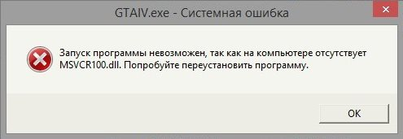
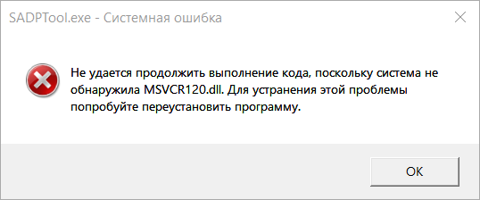
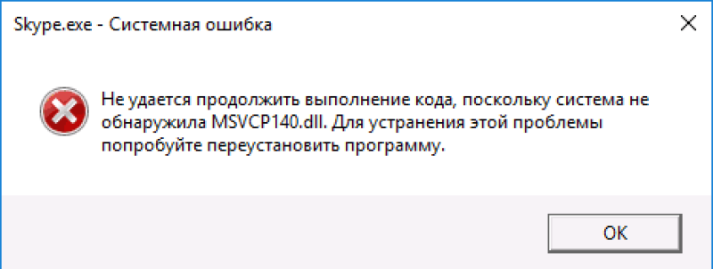

# Не удается продолжить выполнение кода, поскольку система не обнаружила MSVCR100/110/120/140.dll. Для устранения этой проблемы попробуйте переустановить программу.

Эта ошибка появляется, когда в системе отсутствует одна из версий Visual C++. Вам необходимо [установить common redistributables](common-redistributables.md).

После этого запустите игру снова.