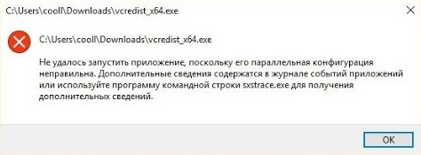

# Не удалось запустить приложение, поскольку его параллельная конфигурация неправильна. Дополнительные сведения содержатся в журнале событий приложений или используйте программу командной строки sxstrace.exe для получения дополнительных сведений.

Эта ошибка появляется, когда в системе отсутствует одна из версий Visual C++. Вам необходимо [установить common redistributables](common-redistributables.md).

После этого запустите игру снова.