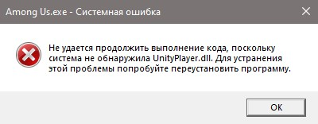

# Не удается продолжить выполнение кода, поскольку система не обнаружила UnityPlayer.dll. Для устранения этой проблемы попробуйте переустановить программу.

Файл `Unityplayer.dll` был помещен в карантин вашим антивирусом, вам нужно [восстановить его в Windows Defender](restore-files.md).

::: warning Если же в карантине нет этого файла, вам нужно [добавить папку с игрой в исключения антивируса](add-exclusion.md), а после [использовать папку Fix Repair](fix-repair.md).
:::

После этого запустите игру снова.