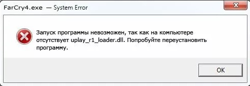

# Не удается продолжить выполнение кода, поскольку система не обнаружила uplay_r1_loader64.dll. Для устранения этой проблемы попробуйте переустановить программу. 

Файл `uplay_r1_loader64.dll` был помещен в карантин вашим антивирусом, вам нужно [восстановить его в Windows Defender](restore-files.md).

После восстановления файла `uplay_r1_loader64.dll`, запустите игру снова.