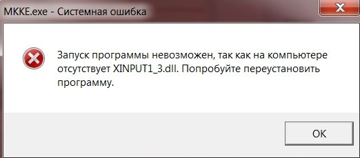

# Не удается продолжить выполнение кода, поскольку система не обнаружила XINPUT1_3.dll. Для устранения этой проблемы попробуйте переустановить программу.

Ошибки такого типа возникают из-за отсутствия одной из версий DirectX на вашем компьютере. Поэтому установите [common redistributables](common-redistributables.md).

После этого запустите игру снова.